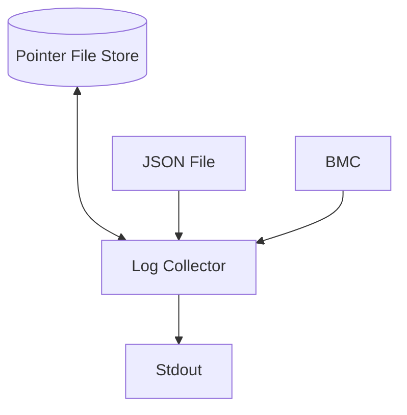

# BMC Log Collector Design

“BMC Log Collector” collects hardware errors from Baseboard Management Controller (BMC) and outputs them to its own stdout.
In case of DELL hardware, “BMC Log Collector” collects System Event Log (SEL) and Lifecycle (LC) log from iDRAC.
The first case of collecting is DELL.

“BMC Log Collector” has the following features
1. Retrieve the IP address and ID of the BMC to be collected from a JSON file
2. Access the IP address of the BMC and retrieve a hardware error logs from the Redfish REST service
3. ~~Output the collected logs that eliminated duplication to STDOUT~~

Redfish is a standard for server management and provides information as REST API service. 
We can get the event of hardware in Server.

## Architecture of BMC Log Collector

The following figure shows an architectural diagram of BMC Log Collector.

```mermaid
flowchart TB
  PS[(Pointer File Store)] <---> LC
  CF[JSON File]-->LC[Log Collector]
  BMC[BMC]-->LC
  LC-->LS[Stdout]
```

1. "JSON File" has BMC IP list, server identity string, server's IP address.
2. "Pointer File Store" has latest pointer information for each BMC.
5. "BMC" is Baseboard Management Controller that has IP address and serves Redfish API.

## How “BMC Log Collector” works

1. Get a list of IP addresses of the BMC in a JSON file
2. Access the Redfish path of the BMC's IP address to get the hardware event log
3. Use `/redfish/v1/Managers/iDRAC.Embedded.1/LogServices/Sel/Entries` as the path to RedFish.
4. Convert the received JSON data into a Go language structure and inspect for duplicates.
5. Compare the ID of the log received last time with the ID of the log received this time. If the ID of the log received this time is larger, it is considered the latest event.
6. If the ID is smaller than the previous one, the timestamp is compare with pointer file, and if it is not qual the first timestamp, it is considered as the latest log.
7. Write ID, time stamp, and identification string in the file. The file name is the identification string, and a separate file is created for each BMC.
8. The latest events in the event log are output in JSON format to standard output.
9. Perform tasks 1 through 8 above, at intervals of a few minutes.
10. Continue this cycle while the “BMC Log Collector” is running.

## How “BMC Log Collector” collects the Lifecycle (LC) log

The LC log is collected in the same way as the SEL with the following differences.

1. Use `/redfish/v1/Managers/iDRAC.Embedded.1/LogServices/Lclog/Entries` as the path to Redfish.
2. This endpoint returns only the latest 50 entries (verified on iDRAC FW 7.20.30.55).
   The collector emits the entries of that page whose ID is larger than the ID recorded
   in the pointer file, and advances the pointer to the newest ID. It does not follow
   `Members@odata.nextLink` to the older pages: the entries that fell off the page since
   the previous cycle are not collected, and a warning is logged in that case. This is
   accepted because the LC log grows only a few entries per day in our fleet (about 2.3
   entries per day per machine on stage0), far below the 50 entries per scraping interval
   that would be needed to lose an entry.
3. The first collection for a machine emits the latest page and continues from its newest
   entry. The whole history is not ingested at once.
4. The entry ID of the LC log restarts from 1 when the log is cleared in iDRAC.
   The clear is detected when the newest ID is smaller than the pointer, or when
   the entry with the ID recorded in the pointer file has a different creation time.
   In both cases the collector emits the whole latest page, as on the first collection.
   The SEL uses the creation time of the oldest entry for this purpose, but the oldest
   entry of the LC log page changes every cycle, so the creation time of the pointered
   entry is recorded in the pointer file instead.
   Note that a clear followed by more new entries than one page within one scraping
   interval cannot be distinguished from a plain backlog: the entries up to the pointered
   ID are skipped as described in 2. This is accepted for the same reason.
5. Each output line has `LogType: "LCLog"` (the SEL lines have `LogType: "SEL"`) so that
   the log type can be distinguished in Loki.
6. A BMC that replies 404 or 405 for the LC log path does not implement the LC log
   service. It is not counted in `bmc_log_requests_failed_total` to avoid a permanent
   false alarm on such machines.
7. The pointer is advanced in the same way as the SEL: when an entry ID cannot be parsed
   or an entry cannot be written, the collector aborts the cycle without advancing the
   pointer and retries in the next cycle; an entry that cannot be marshaled is skipped.
   A creation time that cannot be parsed does not abort the cycle either: the clear
   detection by the creation time is skipped, or the creation time is recorded as
   unknown when it is the newest entry, and the collection goes on by the ID.
8. The numeric, monotonically increasing entry ID is a Dell iDRAC implementation
   behavior, not a Redfish specification guarantee (DSP0266 defines Id only as an
   opaque unique string). This collector is Dell-specific and relies on it, the same
   assumption as the existing SEL collection; it was verified on iDRAC FW 7.20.30.55.
   If a firmware change made the IDs non-numeric, the collector would abort every
   cycle with error logs and the pointer would stay unchanged.
9. The request counters have the `log_type` label (`sel` or `lclog`). Note that the existing
   alert rules aggregate these counters with `sum by(serial)`, so adding the label does not
   break them.

## Architectural Decisions

### ADR1. Obtaining the BMC machine list

There are two ways to obtain the latest BMC listings.

- Method 1: Get the BMC list from the server's database.
- Method 2: Create a JSON file by adding to the existing functions.

#### Advantages of using Method 1
- Reduced risk of failure due to fewer dependent components

#### Disadvantages of using Method 1
- Complex processes to retrieve data from databases, serfs, etc. must be written.

#### Advantages of adopting Method 2
- Programming and testing can be reduced, and the construction period can be shortened.

#### Disadvantages of adopting Method 2
- If an existing function fails, the main function stops.

### Decision and Reason
Adopt method 2.
As a countermeasure against failure, minimize the impact by using the last updated JSON file when the existing function stops.

### ADR2. Control of processing load

There are two possible methods to obtain event logs from the BMC.

- Method 1: The list is stored in the processing queue and worker tasks retrieve it sequentially.

- Method 2: Go routines are started in a number of BMCs, and they are all retrieved at the same time.

#### Advantages of Method 1
- Workload can be controlled by the number of worker tasks

#### Disadvantages of Method 1
- Management of queues and worker processes becomes complicated

#### Advantages of Method 2
- Simplifies Go programming

#### Disadvantages of Method 2
- Load surges occur at the beginning of each collection cycle when there are many target BMCs,Unable to control the load.

### Decision and Reason
Method 2
With the current number of BMCs, load is not a problem.

## Risks

1. There is a concern that log output may be mixed under multi-threaded execution. There is a possibility that this is not thread-safe.
  - Countermeasures
    - Put exclusion control before and after the output to make it thread-safe.

2. Concerns that workload surges will adversely affect others
  - Countermeasures
    - If a problem is discovered, initially limit the number of Go routines by semaphore. If the problem cannot be resolved, consider a queue.

## Usage

please refer [README.md](../README.md)
