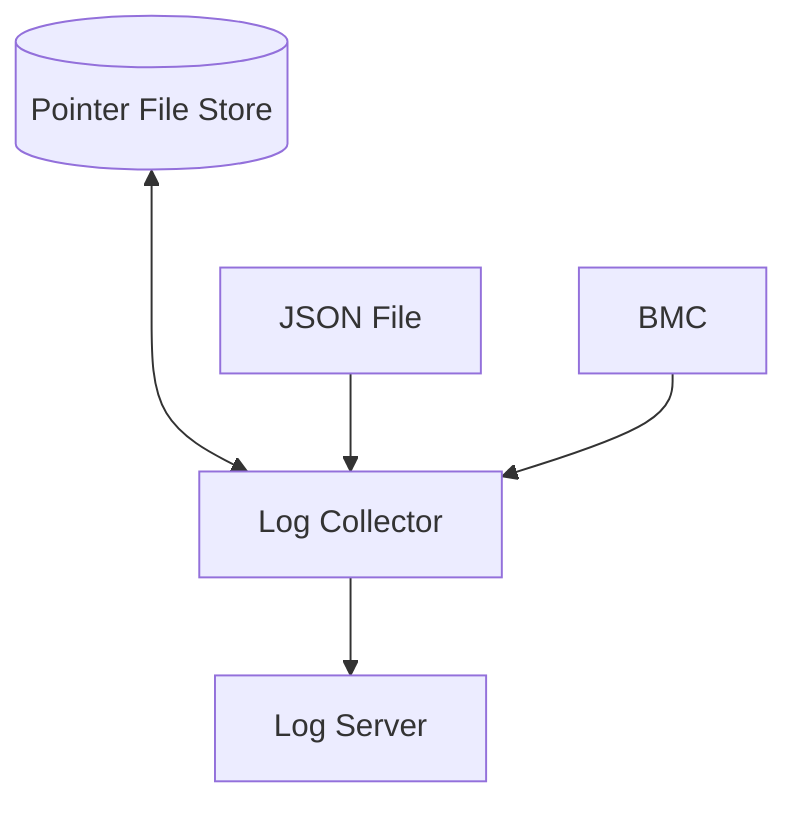

# BMC Log Collector Design

“BMC Log Collector” collects Hareware Error from Baseboard Management Controller (BMC) to the log server.
In case of DELL hardware, “BMC Log Collector” collects System Event Log (SEL) from iDRAC. 
The first case of collecting is DELL.

“BMC Log Collector” has the following features
1. Retrieve the IP address and ID of the BMC to be collected from a JSON file
2. Access the IP address of the BMC and retrieve hardware logs from the Redfish REST service
3. Send the logs to log server by STDOUT through an anti-duplication filter

The anti-duplicate output filtering function removes events that have been output in the past and extracts only new events.
Redfish is a standard for server management. It provides REST API service by BMC. We can get the event of hardware in Server.

## Architecture of BMC Log Collector

The following figure shows an architectural diagram of BMC Log Collector.

1. "JSON File" has BMC IP list, server identity string, server's IP address.
2. "Pointer File Store" has latest pointer information for each BMC.
3. “Log Server” is a centralized log server like Loki
4. "Log Collector" is this software. Its working describe next section.
5. "BMC" is Baseboard Management Controller that has IP address and serves Redfish API.

## How “BMC Log Collector” works

1. Get a list of IP addresses of the BMC in a JSON file
2. Access the Redfish path of the BMC's IP address to get the hardware event log
3. Use `/redfish/v1/Managers/iDRAC.Embedded.1/LogServices/Sel/Entries` as the path to RedFish.
4. Convert the received JSON data into a Go language structure and inspect for duplicates.
5. Compare the ID of the log received last time with the ID of the log received this time. If the ID of the log received this time is larger, it is considered the latest event.
6. If the ID is smaller than the previous one, the timestamp is compared, and if it is larger than the previous timestamp, it is considered as the latest log.
7. Write ID, type stamp, and identification string in the file. The file name is the identification string, and a separate file is created for each BMC.
8. The latest events in the event log are output in JSON format to standard output.
9. Perform tasks 1 through 8 above, at intervals of a few minutes.
10. Continue this cycle while the “BMC Log Collector” is running.

## Architectural Decisions

### ADR1. Obtaining the BMC machine list

There are two ways to obtain the latest BMC listings.

- Method 1: Get the BMC list from the server's database.
- Method 2: Create a JSON file by adding to the existing functions.

#### Advantages of using Method 1
- Reduced risk of failure due to fewer dependent components

#### Disadvantages of using Method 1
- Complex processes to retrieve data from databases, serfs, etc. must be written.

#### Advantages of adopting Method 2
- Programming and testing can be reduced, and the construction period can be shortened.

#### Disadvantages of adopting Method 2
- If an existing function fails, the main function stops.

### Decision and Reason
Adopt method 2.
As a countermeasure against failure, minimize the impact by using the last updated JSON file when the existing function stops.

### ADR2. Control of processing load

There are two possible methods to obtain event logs from the BMC.

- Method 1: The list is stored in the processing queue and worker tasks retrieve it sequentially.

- Method 2: Go routines are started in a number of BMCs, and they are all retrieved at the same time.

#### Advantages of Method 1
- Workload can be controlled by the number of worker tasks

#### Disadvantages of Method 1
- Management of queues and worker processes becomes complicated

#### Advantages of Method 2
- Simplifies Go programming

#### Disadvantages of Method 2
- Load surges occur at the beginning of each collection cycle when there are many target BMCs,Unable to control the load.

### Decision and Reason
Method 2
With the current number of BMCs, load is not a problem.

## Risks 

1. There is a concern that log output may be mixed under multi-threaded execution. There is a possibility that this is not thread-safe.
  - Countermeasures
    - Put exclusion control before and after the output to make it thread-safe.

2. Concerns that workload surges will adversely affect others
  - Countermeasures
    - If a problem is discovered, initially limit the number of Go routines by semaphore. If the problem cannot be resolved, consider a queue.

## Usage

Under writing
