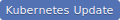
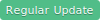
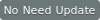

How to maintain neco-containers
===============================

This document describes the procedure for updating each container image.

Besides on-demand container updates, we have two regular renewal operations: `Kubernetes Update` and `Regular Update`.
The target container of these operations have the following badges, so check before the operations.

1 Kubernetes Update ()
   - Upgrade of Kubernetes. Besides the related components of Kubernetes,  update the containers managed by [CKE](https://github.com/cybozu-go/cke/) and some go modules.

2 Regular Update ()
   - Update in every quarter. Keeping up with the upstream version and updating the ubuntu base image.

3 CSA Update  ()
   - Update by CSA team.

4 No Need Update ()
   - Used as a PoC, so regular updates are not required.

---

## admission (neco-admission)


In Kubernetes update:

1. Update the following version variables in `Makefile`.
   - `CONTROLLER_TOOLS_VERSION`
   - `KUSTOMIZE_VERSION`
2. Update go modules.
3. Generate code and manifests.
   ```bash
   $ cd $GOPATH/src/github.com/cybozu/neco-containers/admission
   $ make setup
   $ make generate manifests
   # Commit, if there are any updated files.
   ```
4. Confirm build and test are green.
   ```bash
   $ make build test
   ```
5. Update `TAG` file.

In Regular update, do the following as part of the update of each CRD-providing product:

1. Update a matching version variable from the following in `Makefile`.
   - `CALICO_VERSION`
   - `CONTOUR_VERSION`
   - `ARGOCD_VERSION`
   - `GRAFANA_OPERATOR_VERSION`
2. Modify the code to match the new CRDs if CRDs are changed.
   - The code which depended on the CRDs are in the [hook](https://github.com/cybozu/neco-containers/tree/main/admission/hooks) directory.
   - And let's use `Unstructured` instead of use golang library. Take a look at [this PR](https://github.com/cybozu/neco-containers/pull/339/files).
3. Generate code and manifests.
   ```bash
   $ cd $GOPATH/src/github.com/cybozu/neco-containers/admission
   $ make clean
   $ make generate manifests
   # Commit, if there are any updated files.
   ```
3. Confirm build and test are green.
   ```bash
   $ make build test
   ```
4. Update `TAG` file.

## alertmanager


1. Check the release page.
   - https://github.com/prometheus/alertmanager/releases
2. Check the upstream Dockerfile. If there are any updates, update our `Dockefile`.
   - https://github.com/prometheus/alertmanager/blob/vX.Y.Z/Dockerfile
3. Update version variables in `Dockerfile`.
4. Update `BRANCH` and `TAG` files.

## argocd


1. Check [releases](https://github.com/argoproj/argo-cd/releases) for changes.
2. Check `hack/tool-versions.sh` for the tools versions.
    - https://github.com/argoproj/argo-cd/blob/vX.Y.Z/hack/tool-versions.sh
3. Update tool versions in `Dockerfile`.
    - [Kustomize](https://github.com/kubernetes-sigs/kustomize/releases)
    - [Helm](https://github.com/helm/helm/releases)
4. Check the upstream Dockerfile. If there are any updates, update our `Dockerfile`.
    - https://github.com/argoproj/argo-cd/blob/vX.Y.Z/Dockerfile
5. Update version variables in `Dockerfile`.
    - Update `ARGOCD_VERSION`, `KUSTOMIZE_VERSION` and `HELM_VERSION`.
6. Update `BRANCH` and `TAG` files.

***NOTE:*** ArgoCD depends on dex and Redis. So browse the following manifests and update the [dex](#dex) and [redis](#redis) images next.
- https://github.com/argoproj/argo-cd/blob/vX.Y.Z/manifests/base/dex/argocd-dex-server-deployment.yaml
- https://github.com/argoproj/argo-cd/blob/vX.Y.Z/manifests/base/redis/argocd-redis-deployment.yaml

***NOTE:*** ArgoCD's Application objects are validated by [neco-admission](#admission-neco-admission).  If Application CRD has been changed, you may need to update [neco-admission](#admission-neco-admission).

## bird


1. Check the [releases page](https://bird.network.cz/?download) in the official website.
2. Update `BIRD_VERSION` variable in `Dockerfile`.
3. Update image tag in `README.md`.
4. Update `BRANCH` and `TAG` files.

## bmc-reverse-proxy


1. Update go modules.
   ```bash
   $ cd $GOPATH/src/github.com/cybozu/neco-containers/bmc-reverse-proxy
   $ K8SLIB_VERSION=X.Y.Z # e.g. K8SLIB_VERSION=0.18.9
   $ go get -d k8s.io/apimachinery@v$K8SLIB_VERSION k8s.io/client-go@v$K8SLIB_VERSION
   $ go mod tidy
   ```
2. Confirm test are green.
   ```bash
   $ make test
   ```
3. Update image tag in `bmc-reverse-proxy.yaml`.
4. Update `TAG` file.

## cadvisor


1. Check the [release page](https://github.com/google/cadvisor/releases).
2. Check the upstream build files. If there are any updates, update our `Dockerfile`.
   - https://github.com/google/cadvisor/blob/vX.Y.Z/Makefile
   - https://github.com/google/cadvisor/blob/vX.Y.Z/build/release.sh
   - https://github.com/google/cadvisor/blob/vX.Y.Z/build/build.sh
   - https://github.com/google/cadvisor/blob/vX.Y.Z/deploy/Dockerfile
3. Update `CADVISOR_VERSION` in `Dockerfile`
4. Update `TAG` file.

## calico


1. Check [the release notes](https://docs.projectcalico.org/release-notes/).
2. Check the upstream Dockerfile. If there are any updates, update our `Dockerfile`.
   - https://github.com/projectcalico/node/blob/vX.Y.Z/Dockerfile.amd64
   - https://github.com/projectcalico/typha/blob/vX.Y.Z/docker-image/Dockerfile.amd64
3. Update version variables (`CALICO_VERSION` and `TINI_VERSION`) in `Dockerfile`.
4. Update image tag in `README.md`.
5. Update `BRANCH` and `TAG` files.

***NOTE:*** Calico's NetworkPolicy objects are validated by [neco-admission](#admission-neco-admission).  If NetworkPolicy CRD has been changed, you may need to update [neco-admission](#admission-neco-admission).

## ceph


1. Check the [release page](https://docs.ceph.com/en/latest/releases/).
2. Check the [build ceph](https://docs.ceph.com/en/latest/install/build-ceph/) document and [README.md](https://github.com/ceph/ceph/blob/main/README.md).
   1. If other instructions are needed for `ceph/build.sh`, add the instructions.
   2. If there are ceph runtime packages or required tool changes, update Dockerfile.
3. Update the `version` argument on the `build-ceph` and `build-ceph-asan` job in the CircleCI `main` workflow.
4. Update `BRANCH` and `TAG` files.

***NOTE:*** The rook image is based on the ceph image. So upgrade the [rook](#rook) image next.

***NOTE:*** Patch fix_pytest_version.patch is temporary. Please remove it after updating to v17.

ref: https://github.com/ceph/ceph/commit/eab195566d54122f826debd8efb7f36db78fa4e1

## cephcsi


1. See [Rook's values.yaml file](https://github.com/rook/rook/blob/master/deploy/charts/rook-ceph/values.yaml) of the appropriate tag and check the version of cephcsi.
2. Update `CSI_IMAGE_VERSION` in Dockerfile with the value which you checked in the previous step.
3. Update `BASE_IMAGE` in Dockerfile if necessary.
   - If `BASE_IMAGE` is too old, the build may fail.
   - You should also check `BASE_IMAGE` in [the upstream build.env](https://github.com/ceph/ceph-csi/blob/devel/build.env) file of the appropriate tag.
4. See [the upstream Dockerfile](https://github.com/ceph/ceph-csi/blob/devel/deploy/cephcsi/image/Dockerfile) of the appropriate tag, and update our Dockerfile if necessary.
5. Update `BRANCH` and `TAG` files.

***NOTE:*** Because cephcsi container is build based on the ceph container, build the ceph container first if necessary.

## ceph-extra-exporter


1. Upgrade direct dependencies listed in `go.mod`. Use `go get` or your editor's function.
2. Upgrade base images in `Dockerfile`.
3. Update the `TAG` files accordingly.

## cert-manager


1. Check [releases](https://github.com/jetstack/cert-manager/releases) for changes.
2. Check the minimum Bazel version in the `WORKSPACE` file. (e.g. `check_min_bazel_version("4.0.0"))`
   - https://github.com/jetstack/cert-manager/blob/vX.Y.Z/WORKSPACE
3. Update the `version` and `bazel-version` arguments on the `build-cert-manager` job in the CircleCI `main` workflow.
4. Update image tag in `README.md`.
5. Update `BRANCH` and `TAG` files.

## chrony


1. Check the [release note](https://chrony.tuxfamily.org/news.html).
2. Update `CHRONY_VERSION` in `Dockerfile`.
3. Update image tag in `README.md`.
4. Update `BRANCH` and `TAG` files.

## cilium


1. Check the [releases](https://github.com/cilium/cilium/releases) page for changes.
2. If necessary, update the `version` parameters for the `build-cilium-envoy` and `build-cilium-image-tools` jobs in the CircleCI `main` workflow.
   1. The `version` for envoy is referenced in the Dockerfile for `cilium` in the source repository and is a commit hash from [cilium/proxy](https://github.com/cilium/proxy)
   2. For image-tools' `version`, use the latest commit hash from [cilium/image-tools](https://github.com/cilium/image-tools)
3. Check whether manually applied patches have been included in the new release and remove them accordingly.
4. Update the `BRANCH` and `TAG` files accordingly.

## cilium-operator-generic


1. Check the [releases](https://github.com/cilium/cilium/releases) page for changes.
2. Update the `BRANCH` and `TAG` files accordingly.

***NOTE:*** The cilium-operator-generic image should be updated at the same time as the cilium image for consistency.

## cilium-certgen


1. Check the [releases](https://github.com/cilium/certgen/releases) page for changes.
2. Check the upstream Dockerfile. If there are any updates, update our `Dockerfile`.
   - https://github.com/cilium/certgen/blob/vX.Y.Z/Dockerfile
3. Update the `BRANCH` and `TAG` files accordingly.

## configmap-reload


1. Check the [tags page](https://github.com/jimmidyson/configmap-reload/tags).
2. Check the upstream Dockerfile. If there are any updates, update our `Dockerfile`.
   - https://github.com/jimmidyson/configmap-reload/blob/vX.Y.Z/Dockerfile
3. Update `CONFIGMAP_RELOAD_VERSION` in `Dockerfile`
4. Update `BRANCH` and `TAG` files.

## contour


***NOTE:*** Contour uses Envoy as a "data plane." Keep version correspondence between the contour and [envoy](#envoy) images. Check the compatibility matrix below.
- [Contour Compatibility Matrix](https://projectcontour.io/resources/compatibility-matrix/)

1. Check the [release page](https://github.com/projectcontour/contour/releases).
2. Check the upstream Dockerfile. If there are any updates, update our `Dockerfile`.
   - https://github.com/projectcontour/contour/blob/vX.Y.Z/Dockerfile
3. Update `CONTOUR_VERSION` in `Dockerfile`.
4. Update image tag in `README.md`.
5. Update `BRANCH` and `TAG` files.

***NOTE:*** Contour's HTTPProxy objects are validated by [neco-admission](#admission-neco-admission).  If HTTPProxy CRD has been changed, you may need to update [neco-admission](#admission-neco-admission).

## coredns


1. Check the [release page](https://github.com/coredns/coredns/releases).
2. Check the upstream Dockerfile. If there are any updates, update our `Dockerfile`.
   - https://github.com/coredns/coredns/blob/vX.Y.Z/Dockerfile
3. Update `COREDNS_VERSION` in `Dockerfile`.
4. Update image tag in `README.md`.
5. Update `BRANCH` and `TAG` files.

## csi sidecars


This section applies to the following containers. These containers are maintained similarly.

- csi-attacher
- csi-node-driver-registrar
- csi-provisioner
- csi-resizer
- csi-snapshotter

1. See [Rook's values.yaml file](https://github.com/rook/rook/blob/master/deploy/charts/rook-ceph/values.yaml) of the appropriate tag and check the version of csi sidecars.
2. Update `VERSION` in Dockerfile with the value which you checked in the previous step.
3. See the upstream Dockerfile of the appropriate tag, and update our Dockerfile if necessary. The upstream Dockerfile is listed below.
   - [csi-attacher](https://github.com/kubernetes-csi/external-attacher/blob/master/Dockerfile)
   - [csi-node-driver-registrar](https://github.com/kubernetes-csi/node-driver-registrar/blob/master/Dockerfile)
   - [csi-provisioner](https://github.com/kubernetes-csi/external-provisioner/blob/master/Dockerfile)
   - [csi-resizer](https://github.com/kubernetes-csi/external-resizer/blob/master/Dockerfile)
   - [csi-snapshotter](https://github.com/kubernetes-csi/external-snapshotter/blob/master/cmd/csi-snapshotter/Dockerfile)
4. Update `BRANCH` and `TAG` files.

***NOTE:*** These softwares are sensitive to the Go version. When you run the CI, warnings about the Go version may occur in `Build images` job. In that case, consider about changing the base container in Dockerfile.

## dex


***NOTE:*** This image is used by [ArgoCD](#argocd). So browse the following manifest and check the required version. If the manifest uses version _a.b.c_, we should use version _a.b.d_ where _d >= c_. Don't use a newer minor version.
- https://github.com/argoproj/argo-cd/blob/vX.Y.Z/manifests/base/dex/argocd-dex-server-deployment.yaml

1. Check the [release page](https://github.com/dexidp/dex/releases).
2. Check the upstream Dockerfile. If there are any updates, update our `Dockerfile`.
   - https://github.com/dexidp/dex/blob/vX.Y.Z/Dockerfile
3. Update `DEX_VERSION` in `Dockerfile`.
4. Update image tag in `README.md`.
5. Update `BRANCH` and `TAG` files.

## dnsmasq


1. Check the http://www.thekelleys.org.uk/dnsmasq/ and find the latest release.
2. Update `DNSMASQ_VERSION` in `Dockerfile`.
3. Update image tag in `README.md`.
4. Update `BRANCH` and `TAG` files.

## envoy


***NOTE:*** Envoy is managed by [Contour](#contour) so update to the supported version. See the below.
- [Contour Compatibility Matrix](https://projectcontour.io/resources/compatibility-matrix/)

1. Check the [release page](https://github.com/envoyproxy/envoy/releases).
2. Check the required bazel version in the following file.
   - https://github.com/envoyproxy/envoy/blob/vX.Y.Z/.bazelversion
3. Update the `version` and `bazel-version` arguments on the `build-envoy` job in the CircleCI `main` workflow.
4. Update image tag in `README.md`.
5. Upgrade direct dependencies listed in `go.mod`. Use `go get` or your editor's function.
6. Update `BRANCH` and `TAG` files.

## etcd


***NOTE:*** Upgrading to etcd 3.4+ will require modifications to CKE, so it should be done separately.

1. Check the [release page](https://github.com/etcd-io/etcd/releases).
2. Check the upstream Dockerfile. If there are any updates, update our `Dockerfile`.
   - https://github.com/etcd-io/etcd/blob/vX.Y.Z/Dockerfile-release
3. Update `ETCD_VERSION` in `Dockerfile`.
4. Update image tag in `README.md`.
5. Update `BRANCH` and `TAG` files.

## external-dns


1. Check the [release page](https://github.com/kubernetes-sigs/external-dns/releases).
2. Check the upstream Dockerfile. If there are any updates, update our `Dockerfile`.
   - https://github.com/kubernetes-sigs/external-dns/blob/vX.Y.Z/Dockerfile
3. Update `EXTERNALDNS_VERSION` in `Dockerfile`.
4. Update image tag in `README.md`.
5. Update `TAG` file.

## fluent-bit


1. Check the [release page](https://github.com/fluent/fluent-bit/releases).
2. Update `FLUENT_BIT_VERSION` in `Dockerfile`.
3. Update `BRANCH` and `TAG`.

This image is referenced in `cybozu-go/moco`. So update the following as well.
- https://github.com/cybozu-go/moco/blob/main/version.go

## golang / golang-bionic


1. Check the [release history](https://golang.org/doc/devel/release.html).
2. Update `GO_VERSION` in `Dockerfile`.
3. Upgrade direct dependencies listed in `analyzer/go.mod`. Use `go get` or your editor's function.
4. Update `BRANCH` and `TAG`.

## gorush

Ignore!!!

## go-ipfs


1. Check the [releases](https://github.com/ipfs/go-ipfs/releases/) page for changes.
2. Update the `BRANCH` and `TAG` files accordingly.

## grafana


1. Check the [release page](https://github.com/grafana/grafana/releases).
2. Check the upstream Dockerfile. If there are any updates, update our `Dockerfile`.
   - https://github.com/grafana/grafana/blob/vX.Y.Z/Dockerfile.ubuntu
   - Check `NODEVERSION` in https://github.com/grafana/grafana/blob/vX.Y.Z/scripts/build/ci-build/Dockerfile
3. Update `GRAFANA_VERSION` in `Dockerfile`.
4. Update installation of Node.js in `Dockerfile` according to `NODEVERSION` if necessary.
5. Update image tag in `README.md`.
6. Update `BRANCH` and `TAG` files.

## grafana-operator


1. Check the [release page](https://github.com/grafana-operator/grafana-operator/releases).
2. Check the upstream Dockerfile. If there are any updates, update our `Dockerfile`.
   - https://github.com/grafana-operator/grafana-operator/blob/vX.Y.Z/Dockerfile
3. Update `VERSION` in `Dockerfile`.
4. Update `BRANCH` and `TAG`.
5. Update `GRAFANA_OPERATOR_VERSION` in `admission/Makefile`.
6. Follow maintenance instructions for neco-admission if needed.

***NOTE:*** Grafana Operator's GrafanaDashboard objects are validated by [neco-admission](#admission-neco-admission).  If GrafanaDashboard CRD has been changed, you may need to update [neco-admission](#admission-neco-admission).


## grafana_plugins_init


grafana_plugins_init does not create [release](https://github.com/grafana-operator/grafana_plugins_init/releases). Use the revision which the operator uses.

1. Check `PluginsInitContainerTag` in `controllers/config/controller_config.go` of grafana-operator.
   - https://github.com/grafana-operator/grafana-operator/blob/vX.Y.Z/controllers/config/controller_config.go
2. Check the upstream Dockerfile. If there are any updates, update our `Dockerfile`.
   - https://github.com/grafana-operator/grafana_plugins_init/blob/A.B.C/Dockerfile
3. Update `GRAFANA_PLUGINS_INIT_VERSION` in `Dockerfile`.
4. Update `BRANCH` and `TAG` according to the value of `PluginsInitContainerTag`.

## heartbeat


Only the base image and module dependency should be updated.

1. Upgrade direct dependencies listed in `go.mod`. Use `go get` or your editor's function.
2. Update `TAG` by incrementing the patch revision, e.g. 1.0.1, 1.0.2, ...


## hubble


1. Check the [releases](https://github.com/cilium/hubble/releases) page for changes.
2. Update the `BRANCH` and `TAG` files accordingly.


## hubble-relay


1. Check the [releases](https://github.com/cilium/cilium/releases) page for changes.
2. Update the `BRANCH` and `TAG` files accordingly.

***NOTE:*** The hubble-relay image should be updated at the same time as the cilium image for consistency.


## hubble-ui


1. Check the [releases](https://github.com/cilium/hubble-ui/releases) page for changes.
2. Update the `BRANCH` and `TAG` files accordingly.
3. `hubble-ui` depends on nginx. As such, it may be also be necessary to bump the following nginx-related variables in the `Dockerfile`:
   1. `NGINX_VERSION`
   2. `NJS_VERSION`
   3. `NGINX_UNPRIVILEGED_COMMIT_HASH`

## ipfs-cluster


1. Check the [releases](https://github.com/ipfs/ipfs-cluster/releases) page for changes.
2. Update `IPFS_CLUSTER_VERSION` in `Dockerfile`.
3. Update `BRANCH` and `TAG` files accordingly.

## kube-metrics-adapter


1. Check the [release page](https://github.com/zalando-incubator/kube-metrics-adapter/releases).
2. Update `KMA_VERSION` in `Dockerfile`.
3. Update `TAG` file.

## kube-state-metrics


1. Check the [release page](https://github.com/kubernetes/kube-state-metrics/releases).
2. Check the upstream Dockerfile. If there are any updates, update our `Dockerfile`.
   - https://github.com/kubernetes/kube-state-metrics/blob/vX.Y.Z/Dockerfile
3. Update `KUBE_STATE_METRICS_VERSION` in `Dockerfile`.
4. Update image tag in `README.md`.
5. Update `TAG` files.

## kube-storage-version-migrator


1. Check the [release page](https://github.com/kubernetes-sigs/kube-storage-version-migrator/releases).
2. Check the upstream build files. If there are any updates, update our `Dockerfile`.
   - https://github.com/kubernetes-sigs/kube-storage-version-migrator/blob/vX.Y.Z/Makefile
   - https://github.com/kubernetes-sigs/kube-storage-version-migrator/blob/vX.Y.Z/cmd/initializer/Dockerfile
   - https://github.com/kubernetes-sigs/kube-storage-version-migrator/blob/vX.Y.Z/cmd/migrator/Dockerfile
   - https://github.com/kubernetes-sigs/kube-storage-version-migrator/blob/vX.Y.Z/cmd/trigger/Dockerfile
3. Update `MIGRATOR_VERSION` in `Dockerfile`
4. Update `TAG` file.

## kubernetes


1. Check the [release page](https://github.com/kubernetes/kubernetes/releases).
2. Check if each of the patches is still necessary.
3. Update `K8S_VERSION` in `Dockerfile`.
4. Update image tag in `README.md`.
5. Update `BRANCH` and `TAG` files.

## local-pv-provisioner


1. Update version variables in `Makefile`.
2. Update go modules.
   ```bash
   $ cd $GOPATH/src/github.com/cybozu/neco-containers/local-pv-provisioner
   $ K8SLIB_VERSION=X.Y.Z # e.g. K8SLIB_VERSION=0.18.9
   $ go get -d k8s.io/api@v$K8SLIB_VERSION k8s.io/apimachinery@v$K8SLIB_VERSION k8s.io/client-go@v$K8SLIB_VERSION
   $ go get -d sigs.k8s.io/controller-runtime@v<CTRL_VERSION>
   $ go mod tidy
   ```
3. Generate code and manifests.
   ```bash
   $ cd $GOPATH/src/github.com/cybozu/neco-containers/local-pv-provisioner
   $ make generate manifests
   # Commit, if there are any updated files.
   ```
4. Confirm build and test are green.
   ```bash
   $ make build test
   ```
5. Update image tag in `local-pv-provisioner.yaml`.
6. Update `TAG` file.

## loki


1. Check the [release page](https://github.com/grafana/loki/releases).
2. Check the upstream Dockerfile. If there are any updates, update our `Dockerfile`.
   - https://github.com/grafana/loki/blob/vX.Y.Z/cmd/loki/Dockerfile
3. Update `LOKI_VERSION` in `Dockerfile`.
4. Update `BRANCH` and `TAG` files.

***NOTE:*** Keep the version of [promtail](#promtail) the same as that of loki.

## machines-endpoints


1. Update version variables in `Makefile`.
2. Update go modules.
   ```bash
   $ cd $GOPATH/src/github.com/cybozu/neco-containers/machines-endpoints
   $ K8SLIB_VERSION=X.Y.Z # e.g. K8SLIB_VERSION=0.18.9
   $ go get -d k8s.io/api@v$K8SLIB_VERSION k8s.io/apimachinery@v$K8SLIB_VERSION k8s.io/client-go@v$K8SLIB_VERSION
   $ go mod tidy
   ```
3. Confirm test is green.
   ```bash
   $ make test
   ```
4. Update image tag in `machines-endpoints.yaml`.
5. Update `TAG` file.


## memcached


1. Check the [release page](https://github.com/memcached/memcached/wiki/ReleaseNotes).
2. Update `MEMCACHED_VERSION` in `Dockerfile`.
3. Update `BRANCH` and `TAG` file.

## memcached_exporter


1. Check the [release page](https://github.com/prometheus/memcached_exporter/releases).
2. Update `MEMCACHED_EXPORTER_VERSION` in `Dockerfile`.
3. Update `BRANCH` and `TAG` file.

## meows-dctest-runner


1. Check the [release page](https://github.com/cybozu-go/meows/releases).
2. Check the upstream Dockerfile. If there are any updates, update our `Dockerfile`.
   - https://github.com/cybozu-go/meows/blob/vx.y.z/Dockerfile
3. Update `MEOWS_VERSION` in `Dockerfile`.
4. Update `GO_VERSION` and `PLACEMAT_VERSION` in `Dockerfile`, if there are any updates.
   1. `GO_VERSION`: https://github.com/cybozu/neco-containers/blob/main/golang/TAG
   2. `PLACEMAT_VERSION`: https://github.com/cybozu-go/placemat/releases/latest
5. Update `BRANCH` and `TAG` files.

## meows-neco-runner


1. Check the [release page](https://github.com/cybozu-go/meows/releases).
2. Check the upstream Dockerfile. If there are any updates, update our `Dockerfile`.
   - https://github.com/cybozu-go/meows/blob/vx.y.z/Dockerfile
3. Update the `Dockerfile` to install the same tools as ubuntu-debug.
4. Update `MEOWS_VERSION` in `Dockerfile`.
5. Update `BRANCH` and `TAG` files.

## metallb


1. Check the [release page](https://github.com/metallb/metallb/releases).
2. Check the upstream Dockerfile. If there are any updates, update our `Dockerfile`.
   - https://github.com/metallb/metallb/blob/vX.Y.Z/controller/Dockerfile
   - https://github.com/metallb/metallb/blob/vX.Y.Z/speaker/Dockerfile
3. Update `METALLB_VERSION` in `Dockerfile`.
4. Update `BRANCH` and `TAG` files.

## mysql


mysql is used for [MOCO](https://github.com/cybozu-go/moco).
The MySQL versions are the ones supported by MOCO. So the versions need not update usually.
In the regular update, only update the ubuntu base image and module dependency.

1. Upgrade direct dependencies listed in `moco-init/go.mod`. Use `go get` or your editor's function.
2. Update all `TAG` files in sub directories.

## mysqld_exporter


1. Check the [release page](https://github.com/prometheus/mysqld_exporter/releases).
2. Update `MYSQLD_EXPORTER_VERSION` in `Dockerfile`.
3. Update `TAG` file.

This image is referenced in `cybozu-go/moco`. So update the following as well.
- https://github.com/cybozu-go/moco/blob/main/version.go

## nerdctl


1. Check the [release page](https://github.com/containerd/nerdctl/releases).
2. Update `NERDCTL_VERSION` in `Dockerfile`.
3. Update the `BRANCH` and `TAG` files.

## pause


1. Check the changelog.
   - https://github.com/kubernetes/kubernetes/blob/vX.Y.Z/build/pause/CHANGELOG.md
2. Check the upstream Dockerfile. If there are any updates, update our `Dockerfile`.
   - https://github.com/kubernetes/kubernetes/blob/vX.Y.Z/build/pause/Dockerfile
3. Update `PAUSE_VERSION` in `Dockerfile`.
4. Update `BRANCH` and `TAG` files.

## prometheus-adapter


1. Check the release page.
   - https://github.com/kubernetes-sigs/prometheus-adapter/releases
2. Update version variables in `Dockerfile`.
3. Update `TAG` file.

## prometheus-config-reloader


This is a part of [prometheus-operator](https://github.com/prometheus-operator/prometheus-operator/).
This is used by victoria-metrics operator too.

1. Check the latest release of `prometheus-operator`
2. Update version variable in `Dockerfile`.
3. Update `BRANCH` and `TAG` files.

## promtail


Promtail contains two versions, one for promtail and the other for libsystemd.
The promtail version should be the same with [loki](#loki).
The libsystemd version should be the same with the one running on [the stable Flatcar OS](https://kinvolk.io/flatcar-container-linux/releases/).

1. Update `LOKI_VERSION` in `Dockerfile`.
2. Update `SYSTEMD_VERSION` in `Dockerfile` if needed.
3. Update `BRANCH` and `TAG` files.

## pushgateway


1. Check the release page.
   - https://github.com/prometheus/pushgateway/releases
2. Check the upstream Dockerfile. If there are any updates, update our `Dockerfile`.
   - https://github.com/prometheus/pushgateway/blob/vX.Y.Z/Dockerfile
3. Update version variables in `Dockerfile`.
4. Update `BRANCH` and `TAG` files.

## redis


***NOTE:*** This image is used by [ArgoCD](#argocd). So browse the following manifest and check the required version. If the manifest uses version _a.b.c_, we should use version _a.b.d_ where _d >= c_. Don't use a newer minor version.
- https://github.com/argoproj/argo-cd/blob/vX.Y.Z/manifests/base/redis/argocd-redis-deployment.yaml

1. Check the release notes in the [official site](https://redis.io/).
2. Check the Dockerfile in docker-library. If there are any updates, update our `Dockerfile`.
   - v6.2.x: https://github.com/docker-library/redis/blob/master/6.2/Dockerfile
3. Update `REDIS_VERSION` in `Dockerfile`.
4. Update `BRANCH` and `TAG` files.

## registry


1. Check the release notes in the [release page](https://github.com/distribution/distribution/releases).
2. Check the upstream Dockerfile. If there are any updates, update our `Dockerfile`.
   - https://github.com/docker/distribution/blob/master/Dockerfile
3. Update `REGISTRY_VERSION` in `Dockerfile`.
4. Update `BRANCH` and `TAG` files.

## rook


***NOTE:*** Rook update requires two phases. First phase, update rook image solely to update rook version, then release it by neco-apps. Second phase, update Ceph image, and then update Rook base image.

***NOTE:*** A specific version of rook depends on specific versions of csi sidecar containers listed below. Update these containers at the same time.

- cephcsi
- csi-attacher
- csi-node-driver-registrar
- csi-provisioner
- csi-resizer
- csi-snapshotter

1. Check the [release page](https://github.com/rook/rook/releases).
2. Check the upstream Dockerfile. If there are any updates, update our `Dockerfile`.
   - https://github.com/rook/rook/blob/vX.Y.Z/images/ceph/Dockerfile
3. Update `ROOK_VERSION` in `Dockerfile`.
4. Update ceph image tag in `Dockerfile`.
5. Update `BRANCH` and `TAG` files.

## s3gw


Only the base image and module dependency should be updated.

1. Upgrade direct dependencies listed in `go.mod`. Use `go get` or your editor's function.
2. Update `TAG` by incrementing the patch revision, e.g. 1.0.1, 1.0.2, ...

## sealed-secrets


1. Check the [release page](https://github.com/bitnami-labs/sealed-secrets/releases).
2. Check the upstream Dockerfile and compare with ours especially on the runtime stage. If there are any updates, update our `Dockerfile`.
    - https://github.com/bitnami-labs/sealed-secrets/blob/vX.Y.Z/Dockerfile
3. Update `SEALED_SECRETS_VERSION` in `Dockerfile`.
4. Update `BRANCH` and `TAG` files.

## serf


1. Check the [release page](https://github.com/hashicorp/serf/releases).
2. Check the upstream Dockerfile. If there are any updates, update our `Dockerfile`.
   - https://github.com/hashicorp/serf/blob/vX.Y.Z/scripts/serf-builder/Dockerfile
3. Update `SERF_VERSION` in `Dockerfile`.
4. Update image tag in `README.md`.
5. Update `BRANCH` and `TAG` files.

## squid


1. Check the latest **stable** version at http://www.squid-cache.org/Versions/
2. Check release notes if a new version is released.
    - e.g., http://www.squid-cache.org/Versions/v4/squid-4.13-RELEASENOTES.html
3. Update `SQUID_VERSION` in `Dockerfile`.
4. Update image tag in `README.md`.
5. Update `BRANCH` and `TAG` files.

## teleport-node


1. Check the [release page](https://github.com/gravitational/teleport/releases).
2. Check the upstream `Makefile` and `docker/Dockerfile`. If they have been updated significantly, update our `Dockerfile`.
   - https://github.com/gravitational/teleport/blob/vX.Y.Z/Makefile
   - https://github.com/gravitational/teleport/blob/vX.Y.Z/docker/Dockerfile
3. Update `TELEPORT_VERSION` in `Dockerfile`.
4. Update `BRANCH` and `TAG` files.

## testhttpd


1. Upgrade direct dependencies listed in `go.mod`. Use `go get` or your editor's function.
2. Update `BRANCH` and `TAG` files.

## unbound


1. Check the [download page](https://www.nlnetlabs.nl/projects/unbound/download/).
2. Update `UNBOUND_VERSION` in `Dockerfile`.
3. Update image tag in `README.md`.
4. Update `BRANCH` and `TAG` files.

## unbound_exporter


1. Check the [release page](https://github.com/letsencrypt/unbound_exporter/releases)
2. Update `UNBOUND_EXPORTER_VERSION` in `Dockerfile`.
3. Update image tag in `README.md`.
4. Update `BRANCH` and `TAG` files.

## vault


1. Check the [release page](https://github.com/hashicorp/vault/releases) and these notes:
    - https://www.vaultproject.io/docs/upgrading
    - https://www.vaultproject.io/docs/release-notes
2. Update `VAULT_VERSION` in `Dockerfile`.
3. Update image tag in `README.md`.
4. Update `BRANCH` and `TAG` files.

## victoriametrics


1. Check the [release page](https://github.com/VictoriaMetrics/VictoriaMetrics/releases).
2. Check upstream `Makefile` and `Dockerfile`, and update our `Dockerfile` if needed.
   - https://github.com/VictoriaMetrics/VictoriaMetrics/blob/vX.Y.Z/Makefile
   - https://github.com/VictoriaMetrics/VictoriaMetrics/blob/vX.Y.Z/app/\*/Makefile
   - https://github.com/VictoriaMetrics/VictoriaMetrics/blob/vX.Y.Z/app/\*/deployment/Dockerfile
   - https://github.com/VictoriaMetrics/VictoriaMetrics/blob/vX.Y.Z-cluster/Makefile
   - https://github.com/VictoriaMetrics/VictoriaMetrics/blob/vX.Y.Z-cluster/app/\*/Makefile
   - https://github.com/VictoriaMetrics/VictoriaMetrics/blob/vX.Y.Z-cluster/app/\*/deployment/Dockerfile
3. Update `VICTORIAMETRICS_SINGLE_VERSION` and `VICTORIAMETRICS_CLUSTER_VERSION` in `Dockerfile`.
4. Update `BRANCH` and `TAG` files.

## victoriametrics-operator


1. Check the [release page](https://github.com/VictoriaMetrics/operator/releases).
2. Check upstream Makefile and Dockerfile, and update our Dockerfile if needed.
3. Update `VICTORIAMETRICS_OPERATOR_VERSION` in `Dockerfile`.
4. Update `BRANCH` and `TAG` files.
