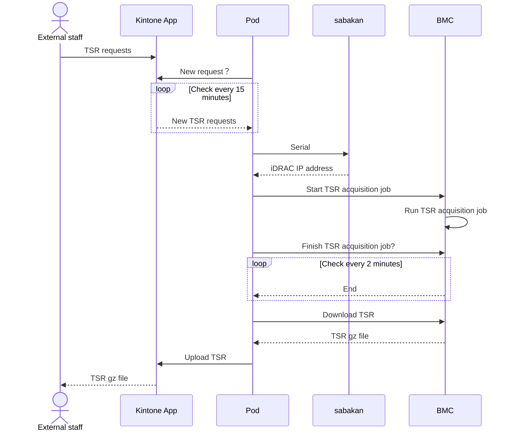
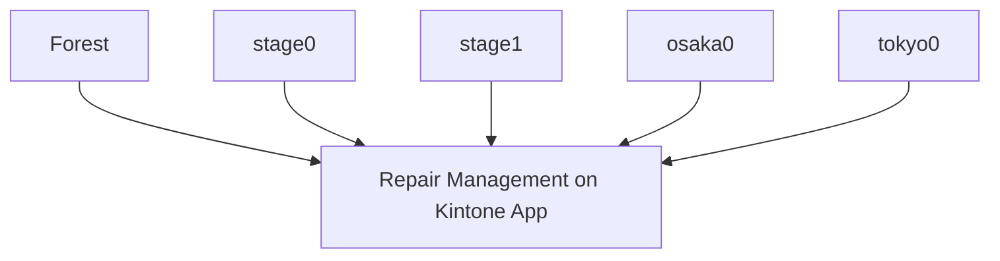

# TSR Transporter

The TSR transporter receives TSR requests from Kintone apps, obtains TSRs from BMC, and registers them in Kintone apps.

## Process flow
1. External staff inputs “TSR requests” into existing Kintone apps.
2. Periodically call the Kintone API from the pod to detect new TSR requests.
3. Obtain the IP address of BMC from the serial (service tag) from sabakan.
4. The pod starts TSR acquisition jobs in BMC by Redfish's API, wait until acquisition is complete, and then download the TSR to the pod.
5. Upload TSR from Pod to Kintone app
6. External staff access the Kintone app and obtain TSRs.

Sequence Diagram

##  Kubernetes clusters and Kintone App diagram
Each pod in the Kubernetes environment checks for TSR acquisition requests to the Kintone app "Repair Server Management".
The pod accesses sabakan in each environment and, if there is the target server in its own environment, requests TSR to BMC. 

