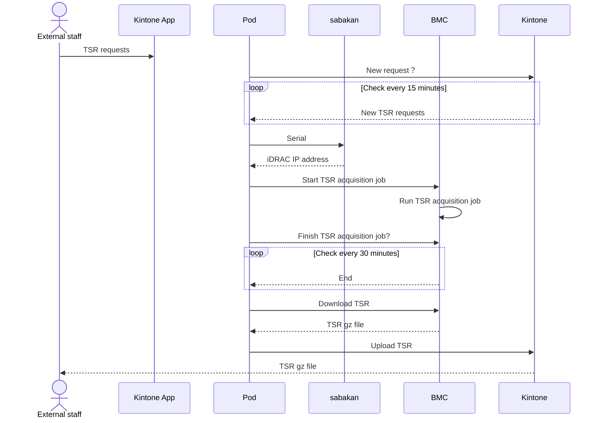

# TSR Transporter

Process flow
1 External staff inputs “TSR requests” into existing Kintone apps.
2 Periodically call the Kintone API from the pod to detect new TSR requests.
3 Obtain the IP address of BMC from the serial (service tag) from sabakan.
4 The pod starts TSR acquisition jobs in BMC by Redfish's API, wait until acquisition is complete, and then download the TSR to the pod.
5 Upload TSR from Pod to Kintone app
6 External staff access the Kintone app and obtain TSRs.

Sequence Diagram

```mermaid
sequenceDiagram
actor External staff
participant Kintone App
participant Pod
participant sabakan
participant BMC
External staff->>Kintone App:TSR requests
Pod->>Kintone: New request？
loop Check every 15 minutes
Kintone-->>Pod:New TSR requests
end
Pod->>sabakan: Serial
sabakan-->>Pod: iDRAC IP address
Pod->>BMC: Start TSR acquisition job
BMC->>BMC: Run TSR acquisition job
Pod->>BMC: Finish TSR acquisition job?
loop Check every 30 minutes
BMC-->>Pod: End
end
Pod->>BMC: Download TSR
BMC-->>Pod: TSR gz file
Pod->>Kintone: Upload TSR
Kintone-->>External staff: TSR  gz file
```
